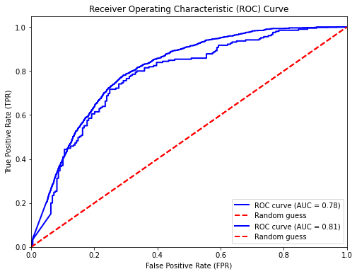

# stocks_ML

## Overview
`stocks_ML` is a Python-based project that uses TensorFlow and Long Short-Term Memory (LSTM) neural networks to analyze stock time series data. The model is designed to predict which stocks are likely to perform well on the next day based on the previous day's data. **This project does not provide financial advice or recommendations for buying or selling stocks.** It is intended for educational and research purposes only.

## Features
- Utilizes LSTM networks for time series forecasting.
- Input: Historical stock data (previous day's data points such as open, close, high, low, volume).
- Output: Probability scores indicating which stocks are likely to perform well on the next day.
- Performance evaluation using standard metrics like accuracy and ROC-AUC curve.

## Technologies
- **Python 3.x**
- **TensorFlow 2.x**
- **Pandas, NumPy** for data manipulation.
- **Matplotlib** for data visualization and result plotting.
- **yfinance** for downloading stock data.

## Performance
The model achieves approximately **80% accuracy** in identifying stocks that perform exceptionally well (defined as a **>4% increase in stock price** in each of the first four hours of the trading day, compared to the same hour the previous day). This performance is based on test data after training on historical data using the LSTM model.

Below is the ROC curve of the model (`binary_model_1695stocks_31days_4percent_2024_07_05`), which is the most recent and best-performing model available in the repository.



This model demonstrates strong predictive power for identifying stocks likely to perform well, with high sensitivity and specificity as shown in the ROC curve.

## Models
Various trained models are saved as `.keras` files in the `models/` directory.

- The file `ROC_binary_model_1695stocks_31days_4percent_2024_07_05.keras` is the **best-performing model** so far, with the highest accuracy and ROC-AUC score on the test data.
- You can load these models for predictions or further fine-tuning.

## Installation
To get started, clone the repository and install the required dependencies:

```bash
git clone https://github.com/noahhood/stocks_ML.git
cd stocks_ML
pip install -r requirements.txt